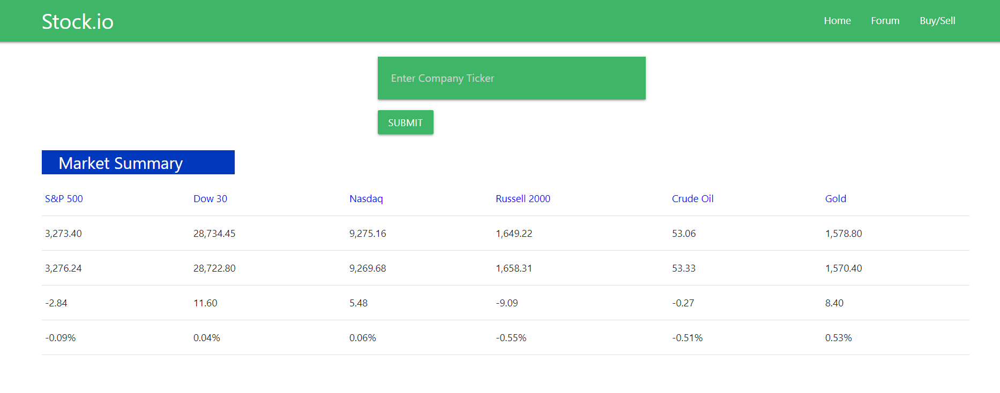
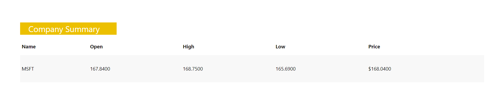
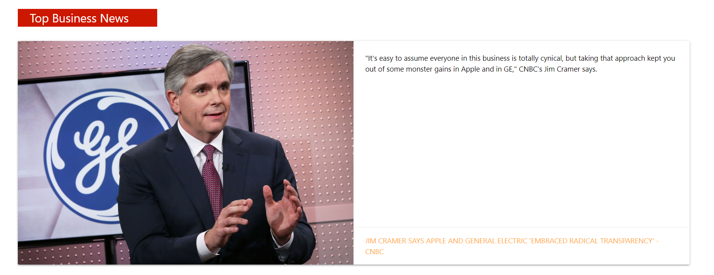
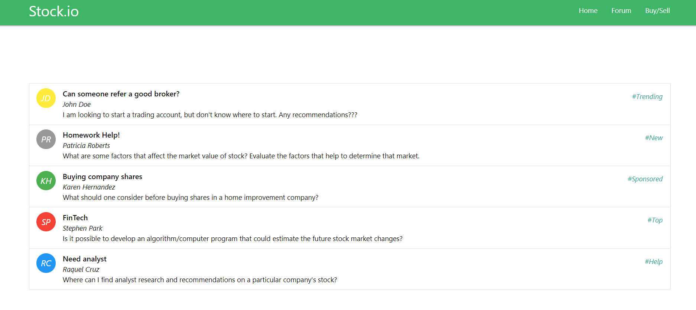
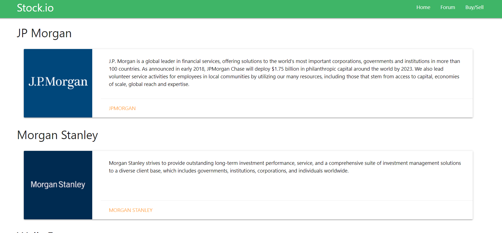

# stock.io

Rutgers Coding Bootcamp Project 1 - [Deployed on GitHub Pages](https://amielnicdao.github.io/stock-price/)

Stock application that shows the stock market summary, top 5 business headlines, and a company's stock information in real-time. 

## Getting Started

stock.io can be used to:

  * `check the stock market summary from multiple indices`

  * `input a company's ticker to see name, opening price, high/low prices, and current price`

  * `Read top 5 business headlines`

  * `Read a hardcoded forum`

  * `Get redirected to major brokers`

### Prerequisites

A basic understanding of API's and AJAX calls.

### How To Use myKeychain

1. Go to [stock.io's GitHub Page.](https://amielnicdao.github.io/stock-price/)
2. Once on the homepage, you will see the stock market summary, a company's stock information, and the top 5 business news.

  **Market Summary**

    

  **Company Summary**

  * Appears after entering the company's ticker

    
    

  **Top Business News**

    

4. On the navbar, you can click to see a hardcoded forum and an option to buy and sell which will take you to the major brokers page.

    **Forum**

    

    **Buy/Sell**

    

## Created By

* **Amiel Nicdao** 
* **Khalid Massoud**
* **Jennifer Aguirre**

## Technologies

* HTML
* CSS
* JavaScript
* Materialize CSS
* Alphavantage
* Yahoo! Finance API
* Newsapi.org
* AJAX
* GitHub Pages

## Future Development

* A real forum
* Be able to enter a company's name (not just the ticker) and have the app return information
* Facilitate the buy/sell transactions on the app itself
* Add what the numbers represent under market summary.

## Acknowledgments

* Instructor
* TAs
* Groupmates
